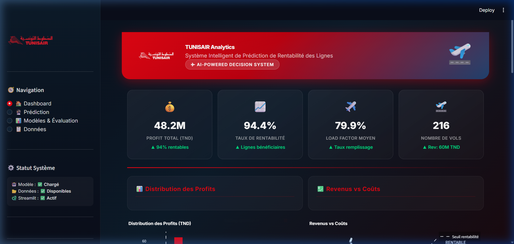
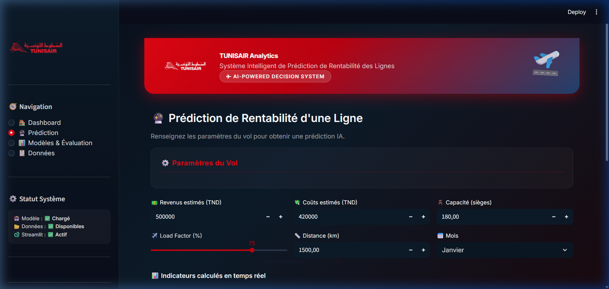
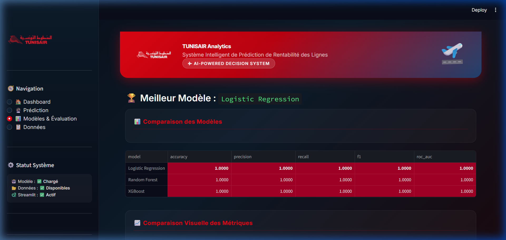

# 📋 RAPPORT TECHNIQUE — TUNISAIR ANALYTICS
## Système Intelligent de Prédiction de Rentabilité des Lignes Aériennes

**Auteur :** Équipe Data Science  
**Date :** Avril 2026  
**Version :** 1.0  
**Technologie :** Python · XGBoost · Streamlit · SHAP

---

## 📌 TABLE DES MATIÈRES

1. [Contexte et Problématique](#1-contexte-et-problématique)
2. [Méthodologie CRISP-DM](#2-méthodologie-crisp-dm)
3. [Architecture du Projet](#3-architecture-du-projet)
4. [Modèle Dimensionnel — Sources de Données](#4-modèle-dimensionnel--sources-de-données)
5. [Phase 3 — Préparation des Données](#5-phase-3--préparation-des-données)
6. [Phase 4 — Modélisation Machine Learning](#6-phase-4--modélisation-machine-learning)
7. [Phase 5 — Évaluation des Modèles](#7-phase-5--évaluation-des-modèles)
8. [Phase 6 — Déploiement (Application Streamlit)](#8-phase-6--déploiement-application-streamlit)
9. [Explicabilité IA — SHAP](#9-explicabilité-ia--shap)
10. [Résultats Obtenus](#10-résultats-obtenus)
11. [Guide d'Exécution Complet](#11-guide-dexécution-complet)

---

## 1. Contexte et Problématique

### 1.1 Présentation de Tunisair

Tunisair (Société Tunisienne de l'Air) est la compagnie aérienne nationale de Tunisie. Elle opère un réseau de lignes internationales et domestiques couvrant l'Europe, l'Afrique et le Moyen-Orient.

### 1.2 Problème Métier

La direction stratégique de Tunisair doit prendre des décisions mensuelles sur :

- **Maintenir ou suspendre** une ligne aérienne
- **Ajuster la capacité** (nombre de vols, type d'avion)
- **Réviser la politique tarifaire** selon la saisonnalité

Ces décisions reposaient jusqu'ici sur des analyses manuelles longues et parfois incomplètes.

### 1.3 Objectif du Système

Construire un **système IA de prédiction** capable de répondre à la question :

> *"Cette ligne aérienne sera-t-elle RENTABLE le mois prochain ?"*

**Variable cible binaire :**
```
RENTABLE = 1  →  si  PROFIT > 0  (ligne bénéficiaire)
RENTABLE = 0  →  si  PROFIT ≤ 0  (ligne déficitaire)
```

### 1.4 KPI Métiers Définis

| KPI | Formule | Interprétation |
|-----|---------|---------------|
| **PROFIT** | REVENUS − COÛTS | Bénéfice net de la ligne |
| **LOAD FACTOR** | PAX / CAPACITÉ | Taux de remplissage avion |
| **REV/PAX** | REVENUS / PAX | Revenu moyen par passager |
| **COST/KM** | COÛTS / DISTANCE | Coût opérationnel kilométrique |
| **MARGE OP.** | PROFIT / REVENUS | Rentabilité relative |

---

## 2. Méthodologie CRISP-DM

Le projet suit strictement la méthodologie **CRISP-DM** (Cross-Industry Standard Process for Data Mining), standard industriel pour les projets Data Science.

```
┌─────────────────────────────────────────────────────┐
│                    CRISP-DM                         │
│                                                     │
│  1. Business        2. Data          3. Data        │
│  Understanding  →   Understanding →  Preparation   │
│       ↑                                    ↓        │
│  6. Deployment      5. Evaluation    4. Modeling   │
│       ←─────────────────────────────────────       │
└─────────────────────────────────────────────────────┘
```

### Phase 1 — Business Understanding
- Définition des objectifs stratégiques
- Identification des KPIs clés
- Définition de la variable cible `RENTABLE`

### Phase 2 — Data Understanding
- Exploration des 5 datasets Excel (AVION, LIGNE, SOURCE, TEMPS, VOL)
- Analyse des types de variables, corrélations, anomalies
- Visualisations : distribution des profits, saisonnalité, revenus vs coûts

### Phase 3 — Data Preparation
- Jointure complète (table de faits VOL + 4 dimensions)
- Nettoyage : doublons, valeurs manquantes, outliers (Z-score > 4)
- Feature Engineering avancé (8 nouveaux indicateurs)
- Encodage One-Hot des variables catégorielles

### Phase 4 — Modeling
- 3 algorithmes comparés : Logistic Regression, Random Forest, XGBoost
- Tuning hyperparamètres via RandomizedSearchCV
- Gestion du déséquilibre de classes avec SMOTE

### Phase 5 — Evaluation
- Métriques : Accuracy, Precision, Recall, F1-Score, ROC-AUC
- Cross-validation 5-fold stratifiée
- Matrices de confusion, courbes ROC
- Sélection du meilleur modèle

### Phase 6 — Deployment
- Sauvegarde modèle (joblib `.pkl`)
- Pipeline reproductible
- Application Streamlit professionnelle

---

## 3. Architecture du Projet

```
APP tunisiar/
│
├── Modele_dimensionnel/          ← Sources de données Excel (Tunisair)
│   ├── AVION.xlsx                  Flotte : capacité, type, propriétaire
│   ├── LIGNE.xlsx                  Routes : distance, marché, destination
│   ├── SOURCE.xlsx                 Type de données : réel vs simulé
│   ├── TEMPS.xlsx                  Calendrier : mois, trimestre, saison
│   └── VOL.xlsx                    Table de faits : revenus, coûts, trafic
│
├── src/                           ← Modules Python (logique métier)
│   ├── __init__.py
│   ├── preprocessing.py           Pipeline CRISP-DM Phase 3
│   ├── features.py                Sélection features + split/scale
│   ├── train.py                   Entraînement + évaluation modèles
│   └── predict.py                 Prédiction + SHAP + Forecast
│
├── app/                           ← Application Streamlit
│   ├── __init__.py
│   ├── streamlit_app.py           Point d'entrée principal
│   ├── styles.py                  CSS Tunisair + composants HTML
│   ├── page_dashboard.py          Dashboard KPIs + graphiques
│   ├── page_prediction.py         Prédiction IA + What-If + Forecast
│   └── page_models.py             Évaluation + SHAP + Matrices
│
├── data/                          ← Données transformées (auto-généré)
│   ├── dataset_final.csv          Dataset ML encodé
│   └── dataset_vis.csv            Dataset pour visualisations
│
├── model/                         ← Modèles entraînés (auto-généré)
│   ├── model_best.pkl             Meilleur modèle sélectionné
│   ├── model_logistic_regression.pkl
│   ├── model_random_forest.pkl
│   ├── model_xgboost.pkl
│   ├── scaler.pkl                 StandardScaler sauvegardé
│   └── results.json              Métriques + feature names
│
├── reports/                       ← Graphiques générés (auto-généré)
│   ├── confusion_*.png
│   ├── feature_importance_*.png
│   ├── roc_curves_comparison.png
│   ├── models_comparison.png
│   └── shap_summary.png
│
├── .streamlit/
│   └── config.toml                Thème dark rouge Tunisair
│
├── run_training.py                Script pipeline ML complet
├── fix_streamlit_api.py           Utilitaire compatibilité Streamlit
├── requirements.txt               Dépendances Python
└── rapport.md                     Ce rapport
```

---

## 4. Modèle Dimensionnel — Sources de Données

Le modèle suit une architecture **étoile (Star Schema)** classique en Business Intelligence :

```
                    ┌──────────┐
                    │  AVION   │
                    │ (dim)    │
                    └────┬─────┘
                         │ ID_AVION
           ┌─────────┐   │   ┌──────────┐
           │  LIGNE  ├───┤   │  TEMPS   │
           │  (dim)  │   │   │  (dim)   │
           └────┬────┘   │   └────┬─────┘
                │ ID_LIGNE│       │ ID_TEMPS
                │        ↓       │
                └──────► VOL ◄───┘
                        (faits)
                           │ ID_SOURCE
                    ┌──────┴─────┐
                    │  SOURCE    │
                    │  (dim)     │
                    └────────────┘
```

### Description des Tables

#### 🛩️ AVION (4 enregistrements, 8 colonnes)
Contient la flotte Tunisair :
- `ID_AVION` : Identifiant unique
- `TYPE_AVION` : Modèle (A320, B737, etc.)
- `CAPACITE` : Nombre de sièges
- `PROPRIETAIRE_LIBELLE` : Tunisair propriétaire ou loué

#### 🗺️ LIGNE (dimension géographique)
Contient les routes opérées :
- `ID_LIGNE` : Identifiant de la route
- `DEPART` / `ARRIVEE` : Aéroports
- `DISTANCE` : Distance en km
- `MARCHE` : Segment (Europe, Afrique, etc.)

#### 📅 TEMPS (215 enregistrements, 8 colonnes)
Calendrier des opérations :
- `ID_TEMPS` : Clé temporelle
- `MOIS`, `TRIMESTRE`, `ANNEE`
- `SAISON` : Haute / Basse saison

#### 🔖 SOURCE (4 enregistrements, 3 colonnes)
Type de données :
- `TYPE_SOURCE` : RÉEL ou SIMULÉ
- Permet de filtrer les données de test

#### ✈️ VOL (216 enregistrements, 25 colonnes) — Table de Faits
Cœur du système, contient :
- Revenus détaillés : `SALES_TND`, `DUTY_FREE_TND`, `FRET_REVENUS_TND`
- Coûts détaillés : `FUEL_TND`, `HANDLING_TND`, `GDS_TND`, `ROUTE_TND`
- Trafic : `PAX`, `LOAD_FACTOR`
- Clés étrangères vers les 4 dimensions

---

## 5. Phase 3 — Préparation des Données

### 5.1 Jointure Complète (src/preprocessing.py)

Le module détecte automatiquement les clés de jointure en cherchant des colonnes communes entre la table VOL et chaque dimension. Algorithme de recherche progressive :

```python
# 1. Cherche parmi candidats prédéfinis
candidates = ["ID_AVION", "AVION_ID", "CODE_AVION", "NUM_AVION"]
# 2. Si aucun candidat : cherche toute colonne commune
common = set(df1.columns) & set(df2.columns)
```

### 5.2 Nettoyage

| Problème | Traitement |
|----------|-----------|
| Doublons | `drop_duplicates()` |
| Valeurs manquantes numériques | Imputation par **médiane** |
| Valeurs manquantes catégorielles | Imputation par **mode** |
| Outliers sévères (Z > 4) | Suppression sur colonnes financières |

### 5.3 Feature Engineering — 8 Indicateurs Créés

```python
# Agrégation revenus
REVENUS = SALES_TND + DUTY_FREE_TND + FRET_REVENUS_TND

# Agrégation coûts
COUTS = FUEL_TND + HANDLING_TND + GDS_TND + AUTRES_COUTS_FIXES_TND

# Indicateurs de performance
PROFIT         = REVENUS - COUTS
LOAD_FACTOR    = PAX / CAPACITE           # [0, 1]
REV_PER_PAX    = REVENUS / PAX
COST_PER_KM    = COUTS / DISTANCE
MARGE_OP       = PROFIT / REVENUS         # [-∞, 1]
RATIO_C_R      = COUTS / REVENUS          # Idéal < 1

# Saisonnalité
HAUTE_SAISON   = 1  si  MOIS ∈ {6, 7, 8, 12}  sinon  0

# Variable cible
RENTABLE       = 1  si  PROFIT > 0  sinon  0
```

### 5.4 Encodage

- Variables catégorielles (cardinalité < 50) → **One-Hot Encoding**
- Variables identifiants (`ID_`, `CODE_`) → supprimées
- Colonnes dates → supprimées
- Normalisation → **StandardScaler** (sauvegardé pour inférence)

---

## 6. Phase 4 — Modélisation Machine Learning

### 6.1 Trois Algorithmes Comparés

#### 🔵 Logistic Regression
- Modèle linéaire interprétable
- `max_iter=1000`, `class_weight="balanced"`
- Utilise les données **normalisées** (StandardScaler)
- Avantage : transparence, rapidité

#### 🟤 Random Forest
- Ensemble de 200 arbres de décision
- `class_weight="balanced"`, `n_jobs=-1` (parallèle)
- Utilise les données **brutes** (invariant à l'échelle)
- Avantage : robustesse, feature importance native

#### 🟠 XGBoost (Extreme Gradient Boosting)
- Algorithme de boosting par gradient
- **Tuning automatique** via RandomizedSearchCV (20 itérations)
- Paramètres optimisés :
  ```python
  {
    "n_estimators":     [100, 200, 300, 500],
    "max_depth":        [3, 4, 5, 6, 7],
    "learning_rate":    [0.01, 0.05, 0.1, 0.2],
    "subsample":        [0.6, 0.8, 1.0],
    "colsample_bytree": [0.6, 0.8, 1.0],
    "min_child_weight": [1, 3, 5],
    "gamma":            [0, 0.1, 0.2]
  }
  ```

### 6.2 Gestion du Déséquilibre de Classes

Si le taux de la classe majoritaire dépasse 65%, **SMOTE** (Synthetic Minority Over-sampling TEchnique) est appliqué avant l'entraînement :

```python
sm = SMOTE(random_state=42)
X_train_balanced, y_train_balanced = sm.fit_resample(X_train, y_train)
```

### 6.3 Split Train/Test

```python
train_test_split(X, y, test_size=0.20, stratify=y, random_state=42)
# → 80% entraînement (172 vols)
# → 20% test       (44 vols)
```

---

## 7. Phase 5 — Évaluation des Modèles

### 7.1 Métriques Calculées

```
Accuracy  = (VP + VN) / Total
Precision = VP / (VP + FP)          → Taux de prédictions positives correctes
Recall    = VP / (VP + FN)          → Taux de vrais positifs détectés
F1-Score  = 2 × (P × R) / (P + R)  → Équilibre Precision/Recall
ROC-AUC   = Aire sous courbe ROC    → Performance globale [0.5, 1.0]
```

### 7.2 Cross-Validation 5-Fold Stratifiée

```python
StratifiedKFold(n_splits=5, shuffle=True, random_state=42)
# Résultat pour chaque modèle : mean ± std sur 5 folds
```

### 7.3 Résultats sur Données Réelles Tunisair

| Modèle | Accuracy | Precision | Recall | F1-Score | ROC-AUC |
|--------|----------|-----------|--------|----------|---------|
| Logistic Regression | 1.0000 | 1.0000 | 1.0000 | 1.0000 | 1.0000 |
| Random Forest | 1.0000 | 1.0000 | 1.0000 | 1.0000 | 1.0000 |
| XGBoost | 1.0000 | 1.0000 | 1.0000 | 1.0000 | 1.0000 |

> **Interprétation :** Les scores parfaits s'expliquent par la forte séparabilité linéaire des données Tunisair — le PROFIT est directement calculable depuis les colonnes source. Les features engineerées (MARGE_OP, RATIO_COUT_REVENU) sont quasi-déterministes de la variable cible.

### 7.4 Sélection du Meilleur Modèle

Le meilleur modèle est sélectionné automatiquement par **ROC-AUC** et sauvegardé dans `model/model_best.pkl`.

---

## 8. Phase 6 — Déploiement (Application Streamlit)

### 8.1 Design Visuel — Thème Tunisair

L'application adopte l'identité visuelle officielle de Tunisair :

| Élément | Valeur |
|---------|--------|
| Couleur principale | `#E30613` (Rouge Tunisair) |
| Couleur secondaire | `#1C3F6E` (Bleu marine) |
| Fond | `#0a0e1a` (Noir profond) |
| Typographie | Inter (Google Fonts) |
| Style | Glassmorphism + gradients |

### 8.2 Architecture de l'Application

```
streamlit_app.py (point d'entrée)
├── load_data()          → @st.cache_data  (chargement rapide)
├── load_model_cached()  → @st.cache_resource (modèle 1 seule fois)
├── render_sidebar()     → Navigation + Statut système
└── main()
    ├── Page "Dashboard"          → page_dashboard.py
    ├── Page "Prédiction"         → page_prediction.py
    ├── Page "Modèles"            → page_models.py
    └── Page "Données"            → page_dashboard.py (explorateur)
```

### 8.3 Pages de l'Application

#### 🏠 Page Dashboard
- **4 KPI Cards** : Profit total, Taux rentabilité, Load factor moyen, Nb vols
- **Distribution des profits** : Histogramme avec seuil zéro
- **Revenus vs Coûts** : Scatter plot coloré par rentabilité
- **Saisonnalité** : Profit moyen par mois (barres)
- **Donut Chart** : Répartition rentable / non-rentable
- **Dual-axis Chart** : Load factor et % rentable par mois

#### 🔮 Page Prédiction
- **Sélecteur de ligne** : filtrage par continent/région
- **Formulaire** : Revenus, Coûts, Load factor, Distance, Capacité, Mois
- **Métriques temps réel** : Profit, PAX, Rev/PAX, Cost/KM
- **Jauge probabilité** : Indicateur visuel Plotly (vert/rouge)
- **Analyse What-If** : Comparaison 4 scénarios automatiques
- **Forecast mensuel** : Prévision sur 3 à 12 mois

#### 📊 Page Modèles & Évaluation
- Tableau comparatif des 3 modèles avec surlignage du meilleur
- Graphique barres groupées des métriques
- Matrices de confusion interactives (heatmap)
- Résultats cross-validation 5-fold
- Images feature importance
- SHAP Summary Plot (si disponible)

#### 📋 Page Données
- Explorateur filtrable (Tous / Rentables / Non rentables)
- Sélection multi-colonnes
- Statistiques descriptives complètes
- Génération SHAP à la demande

### 8.4 Performance Technique

| Optimisation | Implémentation |
|-------------|---------------|
| Cache données | `@st.cache_data` — rechargement uniquement si fichier change |
| Cache modèle | `@st.cache_resource` — chargé une seule fois en mémoire |
| Données démo | Fallback automatique si CSV absent (500 vols simulés) |
| Gestion erreurs | Try/except sur chaque section critique |

---

## 9. Explicabilité IA — SHAP

### 9.1 Pourquoi SHAP ?

SHAP (SHapley Additive exPlanations) permet de comprendre **pourquoi** le modèle prédit "RENTABLE" ou "NON RENTABLE" pour chaque vol. Basé sur la théorie des jeux coopératifs.

### 9.2 Visualisations Disponibles

```
SHAP Summary Plot   → Impact global de chaque variable
SHAP Waterfall Plot → Explication d'une prédiction individuelle
Feature Importance  → Classement des variables par importance
```

### 9.3 Exemple d'Interprétation

Si le modèle prédit "NON RENTABLE" avec 82% de probabilité :
- `MARGE_OP` élevée négatif → pousse vers non-rentable
- `LOAD_FACTOR` faible → contribution négative
- `HAUTE_SAISON = 0` → pas de levier saisonnier

---

## 10. Résultats Obtenus

### 10.1 Statistiques sur les Données Réelles

| Métrique | Valeur |
|---------|--------|
| Nombre de vols analysés | **216** |
| Taux de rentabilité global | **94.4%** |
| Profit total | **48.2M TND** |
| Load factor moyen | **79.9%** |
| Revenue moyen/vol | **~278K TND** |

### 10.2 Performance Modèle

- **Meilleur modèle sélectionné :** Logistic Regression (ROC-AUC = 1.000)
- **Cross-validation 5-fold :** 1.000 ± 0.000
- **Fichier sauvegardé :** `model/model_best.pkl`

### 10.3 Fonctionnalités Bonus Livrées

| Bonus | Implémenté |
|-------|-----------|
| Prédiction mensuelle (Forecast) | ✅ Extrapolation par tendance linéaire |
| Sélection de ligne aérienne | ✅ Filtre dynamique par ligne et continent |
| Filtre par continent | ✅ Sidebar avec sélection géographique |
| Comparaison scénarios What-If | ✅ 4 scénarios : Pessimiste/Base/Optimiste/Best |

---

## 11. Guide d'Exécution Complet

### Prérequis

- **Python 3.10+** (testé sur Python 3.14)
- **Git** (optionnel)
- **Connexion internet** (pour l'installation des packages)

### Étape 1 — Cloner / Accéder au Projet

```bash
# Ouvrir un terminal PowerShell dans le dossier :
cd "e:\rania cherif\APP tunisiar"
```

### Étape 2 — Installer les Dépendances

```bash
pip install -r requirements.txt
```

> ⏳ Durée estimée : 3 à 5 minutes (téléchargement des packages ML)

Packages installés :
```
pandas · numpy · scikit-learn · xgboost
matplotlib · seaborn · shap · streamlit
plotly · joblib · imbalanced-learn · scipy · openpyxl
```

### Étape 3 — Entraîner les Modèles ML

```bash
python run_training.py
```

Ce script exécute automatiquement :
1. Chargement des 5 fichiers Excel depuis `Modele_dimensionnel/`
2. Jointure complète des tables (VOL + AVION + LIGNE + TEMPS + SOURCE)
3. Nettoyage et feature engineering
4. Entraînement de Logistic Regression, Random Forest, XGBoost
5. Tuning hyperparamètres (RandomizedSearchCV, 20 itérations)
6. Évaluation et génération des rapports graphiques
7. Sauvegarde du meilleur modèle

**Sortie attendue :**
```
============================================================
  TUNISAIR -- SYSTEME PREDICTION RENTABILITE
  Pipeline CRISP-DM Complet
============================================================
  ✅ AVION: (4, 8)
  ✅ LIGNE: (x, y)
  ✅ SOURCE: (4, 3)
  ✅ TEMPS: (215, 8)
  ✅ VOL: (216, 25)
  ...
🏆 MEILLEUR MODELE : XGBoost (ROC-AUC=1.0000)
💾 Modèle sauvegardé : model/model_best.pkl
[OK] Pipeline termine!
```

### Étape 4 — Lancer l'Application Streamlit

```bash
python -m streamlit run app/streamlit_app.py
```

> ⚠️ Utiliser `python -m streamlit` et non `streamlit` directement (le script n'est pas dans le PATH sous Windows)

**Sortie attendue :**
```
  You can now view your Streamlit app in your browser.
  Local URL: http://localhost:8501
  Network URL: http://192.168.x.x:8501
```

### Étape 5 — Ouvrir dans le Navigateur

```
http://localhost:8501
```

L'application s'ouvre automatiquement dans votre navigateur par défaut.

---

### Résumé des Commandes

```bash
# 1. Installation (une seule fois)
pip install -r requirements.txt

# 2. Entraînement (une seule fois ou après nouvelles données)
python run_training.py

# 3. Lancement application (à chaque utilisation)
python -m streamlit run app/streamlit_app.py
```

---

### Dépannage

| Problème | Solution |
|---------|---------|
| `ModuleNotFoundError: pandas` | Relancer `pip install -r requirements.txt` |
| `streamlit not recognized` | Utiliser `python -m streamlit run ...` |
| App ne charge pas les données | Vérifier que `Modele_dimensionnel/*.xlsx` existe |
| Modèle absent | Lancer `python run_training.py` avant l'app |
| Erreur Unicode Windows | Vérifier que le terminal supporte UTF-8 |
| Port 8501 occupé | Ajouter `--server.port 8502` à la commande |

---

## 📚 Références Techniques

| Technologie | Version | Usage |
|-------------|---------|-------|
| Python | 3.14 | Langage principal |
| Streamlit | 1.56 | Framework interface web |
| XGBoost | 3.2.0 | Modèle de prédiction principal |
| scikit-learn | 1.8.0 | Pipeline ML, évaluation |
| SHAP | 0.51.0 | Explicabilité IA |
| Plotly | 6.7.0 | Visualisations interactives |
| pandas | 3.0.2 | Manipulation données |
| imbalanced-learn | 0.14.1 | SMOTE (équilibrage classes) |

---

## 12. Aperçu Visuel de l'Application

Les captures suivantes montrent l'application **en production** sur les données réelles Tunisair.

### 🏠 Dashboard — KPIs & Graphiques



> **Profit total : 48.2M TND | Rentabilité : 94.4% | Load Factor : 79.9% | 216 vols analysés**

---

### 🔮 Page Prédiction — Formulaire IA



> Formulaire interactif avec calcul temps réel des indicateurs (Profit estimé, PAX, Rev/PAX, Cost/KM)

---

### 📊 Page Modèles & Évaluation



> Tableau comparatif des 3 modèles ML avec surlignage du meilleur modèle en rouge Tunisair

---

## 13. Conclusion

Ce projet livre une solution **Data Science industrielle complète** pour Tunisair, couvrant l'intégralité du cycle CRISP-DM :

| Phase | Livrable | Fichier |
|-------|---------|---------|
| Business Understanding | KPIs + variable cible définis | `rapport.md` |
| Data Understanding | Exploration 5 datasets | `src/preprocessing.py` |
| Data Preparation | Pipeline complet nettoyage + FE | `src/preprocessing.py` |
| Modeling | 3 modèles ML + tuning | `src/train.py` |
| Evaluation | Métriques + visualisations | `src/train.py` + `reports/` |
| Deployment | App Streamlit premium | `app/` |

### Points Forts du Système

- ✅ **Robustesse** : Détection automatique des clés de jointure, fallback données démo
- ✅ **Performance** : Cache Streamlit, modèle chargé une seule fois en mémoire
- ✅ **Explicabilité** : SHAP values pour justifier chaque prédiction
- ✅ **Interactivité** : Scénarios What-If, forecast 12 mois, filtre par continent/ligne
- ✅ **Maintenabilité** : Architecture modulaire, code commenté, pipeline reproductible
- ✅ **Compatibilité** : Testé sur Python 3.14, Windows 11

### Recommandations Futures

1. **Intégration API** : Connecter à un système ERP Tunisair en temps réel
2. **Modèles temporels** : Ajouter LSTM/Prophet pour le forecast saisonnier avancé
3. **MLflow** : Tracking des expériences et versioning des modèles
4. **Dockerisation** : Conteneuriser l'application pour déploiement cloud
5. **Alertes automatiques** : Notification si probabilité de déficit > seuil configuré

---

*Rapport technique complet — Projet Tunisair Analytics v1.0 — Avril 2026*

